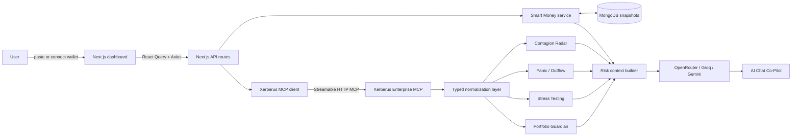

<div align="center">

# Xentinel


### Know your risk. Watch the smart money. Stay ahead of the panic.

Xentinel is an **AI-powered DeFi Risk Co-Pilot + Smart Money Sentinel**. It turns live wallet, position, liquidity, rating, and dependency intelligence into a practical command center for understanding current risk, testing downside scenarios, comparing smart-wallet behavior, and spotting pressure before panic becomes obvious.

**[Watch the walkthrough on Loom](https://www.loom.com/share/18905d2fbb614683a4931abbed072c3f)**

Built for the **Vibe Buildathon DeFi Track**.

</div>

---

## Demo


> A guided tour from wallet analysis to portfolio risk, stress testing, smart-money comparison, panic signals, contagion mapping, AI explanations, and shareable risk insights.

---

## Table of contents

- [The problem](#the-problem)
- [What I built](#what-i-built)
- [Architecture](#architecture)
- [The Xentinel flow](#the-xentinel-flow)
- [Product modules](#product-modules)
- [How Xerberus powers Xentinel](#how-xerberus-powers-xentinel)
- [Wallet coverage](#wallet-coverage)
- [Engineering decisions](#engineering-decisions)
- [Tech stack](#tech-stack)
- [Project layout](#project-layout)
- [Run it locally](#run-it-locally)
- [Environment variables](#environment-variables)
- [Deployment](#deployment)
- [Verification](#verification)
- [Status and limitations](#status-and-limitations)

---

## The problem

DeFi risk is rarely isolated to one balance or one protocol. Users can lose money because they discover danger only after liquidity disappears, ratings deteriorate, smart wallets rotate away, or a dependency failure spreads across connected positions.

Most portfolio dashboards answer **what do I hold?** Xentinel is built around the questions users actually need answered:

1. **What is risky right now?** A balance alone does not explain whether a position is well-built or dangerously connected.
2. **What happens if the market breaks?** Users need exit timing, liquidity pressure, and downside context before stress arrives.
3. **Are experienced wallets changing posture?** Smart-wallet behavior can provide an earlier signal than public panic.
4. **How can one failure reach my portfolio?** Protocol, asset, market, and infrastructure dependencies create hidden contagion paths.
5. **What should I pay attention to first?** Raw risk data still needs a clear, user-facing explanation.

## What I built

Xentinel is a dark, data-dense DeFi risk command center with six connected modules:

- **Portfolio Guardian** analyzes wallet and position risk using intrinsic and systemic lenses.
- **Stress Testing Engine** examines exit timing, crowding, and scenario pressure.
- **Smart Money Sentinel** compares a selected wallet against a tracked smart-wallet watchlist.
- **Panic / Outflow Detector** combines rating drift, systemic pressure, exit liquidity, and wallet changes into early-warning signals.
- **AI Chat Co-Pilot** translates the available risk context into plain-English analysis and practical protection ideas.
- **Beautiful Outputs** packages the current analysis into a shareable risk brief and alert-ready presentation.

Xentinel does not invent positions or silently present unavailable integrations as live data. When an upstream capability is missing, slow, stale, or unavailable, the affected module reports that state honestly.

## Architecture



The browser never receives Xerberus, MongoDB, or AI provider secrets. All external intelligence calls and normalization run server-side.

## The Xentinel flow

1. **Paste or connect a wallet** using a manual Ethereum address or RainbowKit-supported browser wallet.
2. **Analyze the portfolio** using Xerberus wallet, entity, token, and position intelligence.
3. **Load deeper risk sections progressively** so one slow tool does not erase the complete analysis.
4. **Stress test positions** to understand exit windows, liquidity pressure, and downside timing.
5. **Compare smart money** against a curated watchlist and saved MongoDB snapshots.
6. **Detect panic signals** from rating drift, systemic pressure, liquidity constraints, and observed wallet changes.
7. **Ask the AI Co-Pilot** for a plain-English explanation grounded in the available live context.
8. **Review the output brief** for a concise portfolio summary and alert-ready insights.

## Product modules

### Portfolio Guardian

Portfolio Guardian uses Xerberus wallet and position intelligence to surface:

- Overall wallet risk and AAA-D rating
- Intrinsic risk: whether an asset, market, or protocol can fail on its own
- Systemic risk: how external failures and dependencies can affect the position
- Recognized DeFi positions and exposure values
- Position-level ratings and risk reasons
- Highest-risk position and risk distribution

The displayed `0-100` values are normalized risk indicators. They are not probabilities of loss and should not be interpreted as guarantees of safety.

### Stress Testing Engine

Stress Testing Engine helps answer what happens when exits become difficult:

- Exit-liquidity ladder
- One-day, seven-day, and thirty-day exit capacity
- Expected downside exposure and timing
- Panic pressure
- Scenario analysis where the corresponding Xerberus tools return usable data
- Crowding and liquidation positioning where available

### Smart Money Sentinel

Smart Money Sentinel maintains a server-side watchlist of ten public wallet examples and supports additional wallets through `SMART_WALLET_WATCHLIST`.

It provides:

- Current wallet risk ratings
- Previous and current snapshot comparison
- Exposure and risk-score changes
- Recent movement feed
- Selected portfolio risk versus the smart-wallet average
- A baseline state when no prior snapshot exists

MongoDB stores the snapshots used to identify changes over time. It does not store private keys.

### Panic / Outflow Detector

The Panic / Outflow Detector combines available risk signals into an early-warning view:

- Panic meter
- Rating history and rating outlook
- Systemic risk spike indicators
- Exit-liquidity pressure
- Smart-wallet comparison context
- Outflow and rating-drift signals when supported by live history

### Contagion Radar

Contagion Radar turns dependency data into a React Flow graph showing:

- Asset, protocol, and wallet nodes
- Exposure relationships
- Highest-risk dependency path
- Common-cause and systemic context where available

Its purpose is simple: show how a failure elsewhere in DeFi can reach the user's position.

### AI Chat Co-Pilot

The Co-Pilot behaves like a DeFi risk analyst rather than a generic chatbot. Its context can include:

- Portfolio Guardian results
- Intrinsic and systemic risk
- Stress-test results
- Panic and rating signals
- Smart-money comparison
- Contagion paths

AI providers run server-side in this fallback order: **OpenRouter -> Groq -> Gemini**. If every configured provider fails, the API returns a controlled safe-response message instead of exposing provider errors or inventing analysis.

### Beautiful Outputs

Beautiful Outputs presents:

- Wallet risk brief
- Risk visual summary
- Highest-risk position alert
- Rating-state and drift alerts
- Report artifacts when Xerberus `generate_report` is enabled and returns a usable URL

## How Xerberus powers Xentinel

Xentinel uses **Xerberus Enterprise MCP** as its primary risk-intelligence engine. The integration uses Streamable HTTP MCP with session initialization, typed tool wrappers, safe timeouts, structured response parsing, and module-level unavailable states.

The product calls or supports Xerberus tools including:

- `rate_entity`, `rate_token`, and `rate_market`
- `get_positions`
- `portfolio_intrinsic_posture` and `intrinsic_open_risks`
- `risk_decomposition`, `common_cause`, and `infrastructure_risk`
- `portfolio_ladder`, `simulate_scenario`, and `crowding_queue`
- `rating_history` and `rating_outlook`
- `generate_report` when permitted by the Xerberus key tier

Xerberus supplies the underlying ratings and risk primitives. Xentinel normalizes those responses into consistent product-level scores, graphs, timelines, explanations, and alerts. A zero or `NR` value means no usable signal was returned; it does not mean zero risk.

## Wallet coverage

Xentinel currently works best with **Ethereum mainnet EVM wallets using `0x` addresses**.

The richest results come from wallets with Xerberus-recognized:

- Tokens and assets
- Lending positions
- Vault or market exposure
- Protocol-linked positions

Analysis may be limited for empty or new wallets, unsupported assets, CEX deposit addresses, contract-like addresses without portfolio context, non-EVM wallets, and EVM chains outside the current Xerberus coverage window.

## Engineering decisions

- **Xerberus is the source of risk intelligence.** Xentinel does not fabricate wallet positions, ratings, smart-wallet movement, panic signals, or stress results.
- **Progressive analysis isolates slow tools.** Primary wallet results can render while intrinsic and systemic sections load independently.
- **External responses are normalized defensively.** Uncertain MCP payloads remain `unknown` until validated and converted into typed Xentinel models.
- **MCP sessions recover automatically.** Missing or expired session IDs trigger one clean reinitialization before the section becomes unavailable.
- **Secrets remain server-side.** Xerberus, MongoDB, and AI credentials never use `NEXT_PUBLIC_` variables.
- **Smart-wallet changes require history.** The first scan records a baseline; movement appears only after a later snapshot provides a real comparison.
- **AI answers are grounded.** The Co-Pilot receives current module context and is instructed to avoid guarantees, hype, and claims that funds are safe.
- **Production failures stay contained.** Timeouts, key-tier restrictions, stale windows, and upstream challenge pages affect only the relevant module and do not crash the dashboard.

## Tech stack

- **Application:** Next.js 16 App Router, React 19, TypeScript
- **UI:** Tailwind CSS, shadcn-style primitives, Framer Motion, Lucide icons
- **Data fetching:** TanStack React Query, Axios
- **Charts and graphs:** Recharts, React Flow
- **Wallet connection:** RainbowKit, wagmi, viem
- **Persistence:** MongoDB, Mongoose
- **Risk intelligence:** Xerberus Enterprise MCP
- **AI:** OpenRouter, Groq, Gemini

## Project layout

```text
src/
  app/
    api/                         # Next.js server route handlers
    dashboard/                   # dashboard routes and shell
    page.tsx                     # product landing page
  components/
    dashboard/                   # shared dashboard UI
    providers/                   # React Query, theme, wallet providers
    ui/                          # reusable UI primitives
    wallet/                      # RainbowKit wallet controls
  features/
    ai/                          # AI provider chain and Co-Pilot prompt
    contagion/                   # Contagion Radar UI
    copilot/                     # AI Chat Co-Pilot UI
    dashboard/                   # command center overview
    landing/                     # landing-page sections
    outputs/                     # Beautiful Outputs UI
    portfolio/                   # Portfolio Guardian UI
    risk-migration/              # Panic / Outflow Detector UI
    smart-money/                 # watchlist service and UI
    stress-testing/              # Stress Testing Engine UI
    xerberus/                    # MCP client, services, types, normalization
  hooks/                         # typed React Query hooks
  lib/                           # API, database, wallet, and shared helpers
  models/                        # Mongoose models
  types/                         # API and domain types

docs/submission/                 # pitch, demo, architecture, and deployment notes
```

## Run it locally

**Prerequisite:** a current Node.js installation compatible with Next.js 16.

```bash
# 1. Install dependencies
npm install

# 2. Create local configuration
cp .env.example .env.local

# 3. Start the development server
npm run dev
```

Open `http://localhost:3000`.

## Environment variables

Use [`.env.example`](.env.example) as the complete template. The principal variables are:

| Variable | Purpose |
|---|---|
| `MONGODB_URI` | Smart-wallet snapshots and persistence |
| `NEXT_PUBLIC_SITE_URL` | Canonical application URL |
| `NEXT_PUBLIC_API_BASE_URL` | Optional explicit frontend API base URL |
| `NEXT_PUBLIC_WALLETCONNECT_PROJECT_ID` | RainbowKit / WalletConnect project ID |
| `XERBERUS_ENTERPRISE_API_KEY` or `XERBERUS_API_KEY` | Server-only Xerberus Enterprise credential |
| `XERBERUS_ENTERPRISE_MCP_URL` | Enterprise MCP endpoint or approved proxy endpoint |
| `SMART_WALLET_WATCHLIST` | Optional additional watched wallet addresses |
| `AI_PROVIDER` | Preferred AI provider |
| `OPENROUTER_API_KEY` | Optional OpenRouter credential |
| `GROQ_API_KEY` | Optional Groq credential |
| `GEMINI_API_KEY` | Optional Gemini credential |

Never expose Xerberus, MongoDB, or AI credentials with a `NEXT_PUBLIC_` prefix.

## Deployment

The Next.js application and API routes are Vercel-compatible. Production requires:

- Server-only Xerberus credentials
- A reachable Xerberus Enterprise MCP endpoint
- MongoDB access for smart-wallet snapshots
- At least one configured AI provider for live Co-Pilot responses
- A WalletConnect project ID for wallet connection

If the hosting runtime receives a Cloudflare `403` challenge from Xerberus before JSON-RPC handling, route MCP traffic through a server-to-server proxy with an outbound IP that Xerberus can allowlist, then set `XERBERUS_ENTERPRISE_MCP_URL` to that proxy endpoint.

## Verification

```bash
npm run lint
npm run typecheck
npm run build
```

The primary product routes are:

```text
/
/dashboard
/dashboard/portfolio
/dashboard/stress-testing
/dashboard/risk-migration
/dashboard/contagion
/dashboard/smart-money
/dashboard/copilot
/dashboard/outputs
```

## Status and limitations

**Implemented:** landing experience, dashboard shell, Portfolio Guardian, Stress Testing Engine, Smart Money Sentinel, Panic / Outflow Detector, Contagion Radar, AI Chat Co-Pilot, Beautiful Outputs, RainbowKit wallet connection, Xerberus MCP integration, and MongoDB-backed smart-wallet snapshots.

**Current limits:**

- Wallet analysis is strongest for Ethereum mainnet EVM addresses with recognized DeFi exposure.
- Xerberus results depend on tool coverage, data-window freshness, key tier, response time, and upstream availability.
- `generate_report` requires a Xerberus tier that permits report generation and returns a usable artifact URL.
- A first smart-wallet scan establishes a baseline; real movement requires a later snapshot.
- Wallet connection is non-custodial and used only to supply an address. Xentinel does not request signatures or store private keys.

---

## Disclaimer

Xentinel provides risk intelligence and educational analysis. It is **not financial advice** and does not guarantee that any asset, protocol, market, or wallet is safe.

<div align="center">

Built for the <b>Vibe Buildathon DeFi Track</b>.

</div>
